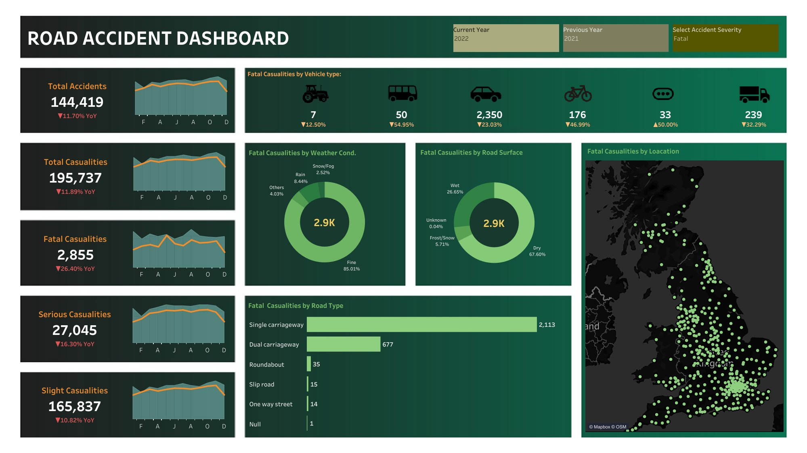

# 🚗 Road Accident Analysis Dashboard (Tableau)

> An interactive Tableau dashboard analysing **660,679 road accident records** across the United Kingdom (2019–2022), built to uncover casualty trends, high-risk conditions, and geographic hotspots for road safety interventions.

---

## 📊 Dashboard Preview



> **Filters active in preview:** Current Year = 2022 | Previous Year = 2021 | Accident Severity = Fatal

---

## 📌 Project Overview

Road accidents are a major public health concern. This dashboard transforms over **660K raw accident records** into a clear, filterable visual story — enabling analysts, policymakers, and safety teams to identify:

- Where casualties are concentrated geographically
- Which vehicle types, road conditions, and weather patterns are highest risk
- How accident and casualty volumes have changed year-over-year
- The breakdown between fatal, serious, and slight casualty severities

---

## 🔑 Key Findings

| # | Finding |
|---|---------|
| 1 | **Total accidents declined 11.70% YoY** (2022 vs 2021) — from 163,554 to 144,419 |
| 2 | **Fatal casualties fell 26.40% YoY** — the steepest improvement across all severity types |
| 3 | **85% of fatal casualties occurred in fine weather** — driver overconfidence in good conditions is a greater risk than adverse weather |
| 4 | **67.6% of fatal casualties happened on dry roads** — corroborating that conditions alone don't explain fatalities |
| 5 | **Cars account for ~75% of all vehicles involved** — by far the dominant vehicle type in accidents |
| 6 | **Single carriageways caused 2,113 fatal casualties** — 3× more than dual carriageways (677) |
| 7 | **Urban areas account for 63.8% of all accidents**, but rural roads are disproportionately fatal due to higher speeds |
| 8 | **Birmingham is the highest-accident district** with 13,491 records — followed by Leeds (8,898) and Manchester (6,720) |
| 9 | **73.4% of all accidents happen in daylight** — but darkness-with-no-lighting accounts for a disproportionate share of fatalities |
| 10 | Accident volume peaked in **October–November** each year, with a consistent dip in December–January |

---

## 📈 Dashboard Features

The Tableau dashboard includes the following views, all linked by interactive filters:

| Panel | Description |
|-------|-------------|
| **KPI Cards** | Total Accidents, Total Casualties, Fatal / Serious / Slight Casualties with YoY trend sparklines |
| **Fatal Casualties by Vehicle Type** | Icon-based KPI tiles showing count and YoY % change per vehicle category |
| **Fatal Casualties by Weather Condition** | Donut chart showing weather breakdown at time of fatal accidents |
| **Fatal Casualties by Road Surface** | Donut chart — Dry vs Wet vs Frost/Snow vs Unknown |
| **Fatal Casualties by Road Type** | Horizontal bar chart ranking road types by fatal casualty count |
| **Fatal Casualties by Location** | UK map with geo-plotted accident locations (latitude/longitude) |
| **Global Filters** | Current Year, Previous Year, Accident Severity selector — all panels update dynamically |

---

## 🗂️ Repository Structure

```
road-accident-dashboard/
│
├── README.md                          # This file
│
├── visuals/
│   └── dashboard_preview.png          # Full dashboard screenshot
│
└── docs/
    ├── data_dictionary.md             # Column-by-column field definitions
    └── key_insights.md                # Detailed analytical findings with numbers
```

> **⬇️ Dataset not included due to file size (88MB).** Download `accident_data.csv` from [UK Road Safety Data – data.gov.uk](https://www.data.gov.uk/dataset/cb7ae6f0-4be6-4935-9277-47e5ce24a11f/road-safety-data) and place it in a `data/` folder at the repo root before opening in Tableau.

---

## 📁 Dataset Description

**Source:** [UK Department for Transport — STATS19 Road Safety Data](https://www.data.gov.uk/dataset/cb7ae6f0-4be6-4935-9277-47e5ce24a11f/road-safety-data)
**Records:** 660,679 accident entries
**Time Range:** January 2019 – December 2022
**Geography:** United Kingdom

| Column | Type | Description |
|--------|------|-------------|
| `Index` | String | Unique accident identifier |
| `Accident_Severity` | Categorical | Fatal / Serious / Slight |
| `Accident Date` | Date | Date of the accident (DD-MM-YYYY) |
| `Latitude` | Float | Geographic latitude of accident location |
| `Longitude` | Float | Geographic longitude of accident location |
| `Light_Conditions` | Categorical | Daylight / Darkness variants |
| `District Area` | String | Local authority district name |
| `Number_of_Casualties` | Integer | Count of casualties in the accident |
| `Number_of_Vehicles` | Integer | Count of vehicles involved |
| `Road_Surface_Conditions` | Categorical | Dry / Wet / Frost / Snow / Flood |
| `Road_Type` | Categorical | Single carriageway / Dual carriageway / Roundabout / etc. |
| `Urban_or_Rural_Area` | Categorical | Urban / Rural / Unallocated |
| `Weather_Conditions` | Categorical | Fine / Raining / Snowing / Fog etc. |
| `Vehicle_Type` | Categorical | Car / Van / Motorcycle / Bus / Goods vehicle etc. |

### Severity Breakdown (Full Dataset)

| Severity | Count | % of Total |
|----------|-------|------------|
| Slight | 563,801 | 85.3% |
| Serious | 88,217 | 13.4% |
| Fatal | 8,661 | 1.3% |

### Year-on-Year Accident Trend

| Year | Accidents | Casualties |
|------|-----------|------------|
| 2019 | 182,115 | 247,780 |
| 2020 | 170,591 | 230,905 |
| 2021 | 163,554 | 222,146 |
| 2022 | 144,419 | 195,737 |

> Consistent downward trend across all 4 years. The 2020 dip is partly attributable to COVID-19 lockdown restrictions reducing traffic volume.

---

## 🛠️ Tools Used

| Tool | Purpose |
|------|---------|
| **Tableau Desktop / Tableau Public** | Dashboard design, interactive filters, map visualisation |
| **Microsoft Excel / CSV** | Data source format |
| **Mapbox + OpenStreetMap** | Underlying map tiles for the geo scatter layer |

---

## 🚀 How to Reproduce This Dashboard

### Step 1 — Get the Data
Download the dataset from [UK Road Safety Data – data.gov.uk](https://www.data.gov.uk/dataset/cb7ae6f0-4be6-4935-9277-47e5ce24a11f/road-safety-data) and save it as `data/accident_data.csv` in the repo root.

### Step 2 — Open in Tableau

**Tableau Public (Free)**
1. Go to [public.tableau.com](https://public.tableau.com) and sign in
2. Click **Create → Web Authoring** and connect to the CSV file
3. Build the sheets and dashboard as described below
4. Publish for a free shareable URL

**Tableau Desktop**
1. Open Tableau Desktop → Connect → **Text File** → select `accident_data.csv`
2. Ensure `Accident Date` is parsed as a Date field (format: DD-MM-YYYY)
3. Rebuild or import the workbook

### Step 3 — Rebuild the Dashboard (from scratch)
1. Parse `Accident Date` → create calculated fields for `Year` and `Month`
2. Create a `YoY %` calculated field: `(CY Measure - PY Measure) / PY Measure`
3. Build individual sheets: KPI cards with sparklines, donut charts, horizontal bar, geo scatter map
4. Assemble all sheets on a Dashboard canvas (1400 × 850px recommended)
5. Add **filter actions** so the Year and Severity selectors update all panels simultaneously

---

## 💡 Potential Extensions

- **Predictive model** — Train a classifier to predict accident severity from road/weather/vehicle features
- **Time-series forecasting** — Project future accident volumes using ARIMA or Prophet
- **District-level heatmap** — Choropleth map aggregating casualties per district for policy targeting
- **Python EDA companion notebook** — Reproduce the same insights in a Jupyter notebook for portfolio depth
- **Real-time integration** — Connect to live UK government STATS19 accident data feed

---

## 📄 Data Source & License

- Dataset based on UK Road Safety Data (STATS19) — publicly available from the [UK Department for Transport](https://www.data.gov.uk/dataset/cb7ae6f0-4be6-4935-9277-47e5ce24a11f/road-safety-data)
- Dashboard and analysis: original work
- This repository is for portfolio and educational purposes

---

*If you found this useful, feel free to ⭐ the repo!*
